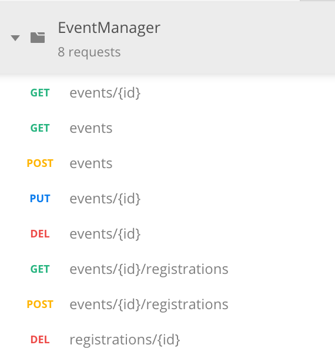

# Event Manager API 

This project was built with Symfony 4 by Nicolae Tusinean.

Website: https://nicolaetusinean.ro

Linkedin ID: nicolaetusinean 

# 

# Setup the project
1. Install composer: https://getcomposer.org/ 
2. In CMD open the workspace of this project
3. Run: `composer install`
4. Edit `.env` with yours `DATABASE_URL` settings or create an `.env.local` file with your own settings

## Development server
Either run the project on your Apache environment

or 

Run `php bin/console server:start` for a dev server. Make calls to `http://localhost:8000/`.

## Running unit tests

Run `./bin/phpunit` to execute the unit tests via [PHP Unit](https://phpunit.de).

## API Documentation

Use [Postman](https://www.getpostman.com/downloads/) to import the API endpoints collection from
`./docs/EventManager.postman_collection.json`

And do not forget to change the URL from http://localhost to http://localhost:8000/ if you use build-in server.

This API doesn't include Hypermedia and it uses URI Versioning instead of Media Type Versioning.

## Codebase

The model layer uses the [Pomm Project](http://pomm-project.org).
I tried to keep a low coupling profile between Pomm and my implementation, but there is room for improvement.

## Database 

Use PostgreSQL.

Run the SQL file from `./db/eventmanager.db.sql` to create the database and insert data.

